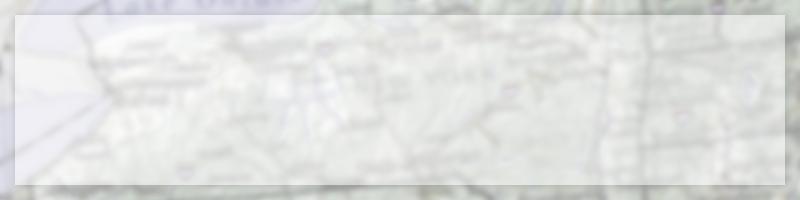

# Start to work on final

* [Getting Started]()
* [Download Content](content.html)
* [Download Images](images.html)
* [View](view.html)

This week we will start to work on the class final.  The final will pull from all the lessons of this session.  Nothing should be a surprise to you.   You can use your class notes, lesson examples or any other resource you need to finish the final.  The final must be sent to me by the end of the last class at 10:00.

You will be responsible for creating all the markup and css for the whole site.   You are free to work any way that you want to complete the project I would recommend working this way.

 Get the basic HTML structure set up.
Get a basic css file in place to ensure the links work
Get all the all the pages in place and ensure they link together
Finish the CSS
Fill in the rest of the content
Add finishing touches

I have include everything you will need to build the page.

<a href='final.psd' class='btn'>Download PSD</a>

## PSD

The PSD is a great place to get started.  This can give you all the info you will need to build out the HTML and css.  I like to use the PSD to get the sizes and colors of the different elements.

## Colors

Below are a list of the colors needed to build the pages.

  

    

      <svg viewBox="0 0 64 64" width="64" height="64" style="display:block;width:100%;height:auto">
        <rect width="64" height="64" fill="#e8d1b2"></rect>
      </svg>
    

    
#e8d1b2

  

  

    

      <svg viewBox="0 0 64 64" width="64" height="64" style="display:block;width:100%;height:auto">
        <rect width="64" height="64" fill="#d0a264"></rect>
      </svg>
    

    
#d0a264

  

  

    

      <svg viewBox="0 0 64 64" width="64" height="64" style="display:block;width:100%;height:auto">
        <rect width="64" height="64" fill="#ffffff"></rect>
      </svg>
    

    
#ffffff

  

  

    

      <svg viewBox="0 0 64 64" width="64" height="64" style="display:block;width:100%;height:auto">
        <rect width="64" height="64" fill="#c81b00"></rect>
      </svg>
    

    
#c81b00

  

  

      

        <svg viewBox="0 0 64 64" width="64" height="64" style="display:block;width:100%;height:auto">
          <rect width="64" height="64" fill="#4354c7"></rect>
        </svg>
      

      
#4354c7

    

## Sizes

Below are some of the key sizes needed to build the pages.

      

        Font Size 60px
      

      

        Font Size 45px
      

      

        Font Size 25px
      

      

        Font Size 20px
      

      

        Font Size 15px
      

      

        Font Size 12px
      

  

## Fonts

Below are the font size and family you will need to use to build the pages.

  arial

  'Montserrat', sans-serif

  'Homemade Apple', cursive

**Note:** you will need to include this at the op of your css file `@import url(http://fonts.googleapis.com/css?family=Homemade+Apple|Montserrat);`

# Images for all pages

* [Getting Started]()
* [Download Content](content.html)
* [Download Images](images.html)

<a href="images.zip" class="btn">Download all the Images</a>

Below are a few images needed to style the site.  You will need to download all the images in the zip file on the left.

##site-bg.jpg

##header.png

##nav-off.jpg

##nav-on.jpg

##ny-seal.png

##sidebar.jpg

