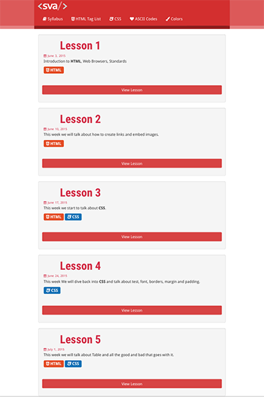
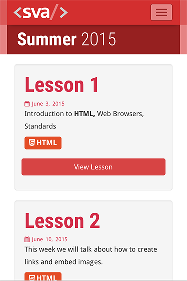

# Responsive web pages

* [Basic Layouts]()
* [Overflow](overflow.html)
* [Responsive](responsive.html)

What is responsive web design?  We think of this as changing the CSS based on the size of the viewable screen.  

So we might want to change the way a page laysout at smaller screen size.  

## Media query

A media query is bit of css code that can look that the screen size and if that check is true display different css.

    body {
      background-color: blue;
    }

    @media screen and (max-width: 200px) {
      body{
        background-color: red;
      }
    }

In this example the body background-color will change to red when the screen width is less than 200px.

With this the selector in the `@media` selector is no more specific than the selector before it.  The only reason it turns red is the order of the CSS.

## Responsive layouts

Because we may want to view a page on screens that vary in size we can use `@meida` to set **break points** that will change the view of the page.

    .wrapper {
      width: 1000px;
      margin: 0 auto;
    }

    article, aside {
      float: left;
    }

    article {
      width: 800px;
      background-color: yellow;
    }

    aside {
      width: 200px;
      background-color: yellowgreen;
    }

    @media screen and (max-width: 1000px) {
      .wrapper {
        width: 800px;
      }

      article {
        width: 600px;
      }
    }

    @media screen and (max-width: 800px) {
      .wrapper {
        width: 600px;
      }

      article {
        width: 400px;
      }
    }

    @media screen and (max-width: 600px) {
      .wrapper {
        width: auto;
      }

      article {
        width: auto;
        float: none;
      }

      aside {
        width: auto;
        float: none;
      }
    }

See the Pen <a href='http://codepen.io/danhahn/pen/QbxYdx/'>QbxYdx</a> by danhahn (<a href='http://codepen.io/danhahn'>@danhahn</a>) on <a href='http://codepen.io'>CodePen</a>.

In this example we set a number of **Break Points**

* 1000px;
* 800px;
* 600px;

So if the screen is wider than 1000px the default styles will be applied.

If the screen is less than 1000px but greater than 800px the wrapper width changes from 1000px to 800px

When the screen gets less than 600px we remove the float and remove the defined widths on all the elements by setting the value to `auto`.

## Responsive but not mobile ready

At this point the page will respond to the different widths but if you view it mobile device it might not look correct.  This has to do with the way screens calculate size.  It will try to shrink the full page to fit in the browser window.  To fix this issue we need to add a `meta` tags to the `head`

    <meta name="viewport" content="width=device-width, initial-scale=1">

This means that the browser will render the width of the page at the width of its own screen. So if that screen is 320px wide, the browser window will be 320px wide, rather than way zoomed out and showing 960px (or whatever that device does by default, in lieu of a responsive meta tag).

without `viewport`  | with `viewport`
--------------------|---------------------
 | 

