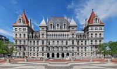
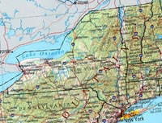

This week we work on the in class final.  

#Final Project

* [Final Project]()
* [Full Image](full.html)

The final is due at the end of class on July 22, 2015.  Please email me at dan@svahtml.com with a zip file that has all the files needed to complete the final.

<a href="summer-2015.psd" class="btn">Download PSD</a>

## Colors

* \#333333
* \#ffffff
* \#808080
* \#a8383b
* \#236167
* \#cccccc
* \#a7a7a7
* \#30858d
* \#000000
* \#de9b9d

## fonts

    @import url(http://fonts.googleapis.com/css?family=Homemade+Apple|Montserrat);
    font-family: 'Montserrat', sans-serif;
    font-family: 'Homemade Apple', cursive;

## header

###### Swatches

* \#ffffff

New York State {font size 60px} 
The Empire State {font size 20px}

## Nav

###### Swatches

* \#a8383b
* \#30858d
* \#ffffff

### Nav Items

* Home(index.html)
* History(history/index.html)
* Geography(geography/index.html)
* Major cities(cities/index.html)
* Demographics(demographics/index.html)
* Transportation(transportation/index.html)
* Sports(sports/index.html)

## Content

###### Swatches

* \#236167
* \#333333
* \#808080
* \#ffffff
* \#a8383b

##New York

New York is a state in the Northeastern and Mid-Atlantic regions of the United States **[1]**. New York is the 27th-most extensive, the third-most populous, and the seventh-most densely populated of the 50 United States. New York is bordered by New Jersey and Pennsylvania to the south and by Connecticut, Massachusetts, and Vermont to the east. The state has a maritime border with Rhode Island east of Long Island, as well as an international border with the Canadian provinces of Quebec to the north and Ontario to the west and north. The state of New York is often referred to as New York State to distinguish it from New York City, its largest city.

*Photo 1*

New York City **[2]**, with a Census-estimated population of over 8.4 million in 2013, is the most populous city in the United States and the nucleus of the premier gateway for legal immigration to the United States—the New York City Metropolitan Area, one of the most populous urban agglomerations in the world. New York City is also known for being the location of Ellis Island, the largest historical gateway for immigration in the history of the United States. A global power city, New York City exerts a significant impact upon commerce, finance, media, art, fashion, research, technology, education, and entertainment. The home of the United Nations Headquarters, New York City is an important center for international diplomacy and has been described as the cultural and financial capital of the world. New York City alone makes up over 40 percent of the population of New York State, while two-thirds of the state's population resides within the New York City Metropolitan Area, and Long Island is home to nearly 40% of New York State's population. Both the state and New York City were named for the 17th century Duke of York, future King James II of England.

*Photo 2*

New York was inhabited by various tribes of Algonquian and Iroquoian speaking Native Americans at the time Dutch settlers moved into the region in the early 17th century. In 1609, the region was first claimed by Henry Hudson for the Dutch. Fort Nassau was built near the site of the present-day capital of Albany in 1614. The Dutch soon also settled New Amsterdam and parts of the Hudson River Valley, establishing the colony of New Netherland. The British annexed the colony from the Dutch in 1664. The borders of the British colony, the Province of New York, were quite similar to those of the present-day state.

About one third of all the battles of the Revolutionary War took place in New York. The state constitution was enacted in 1777. New York became the 11th state to ratify the United States Constitution, on July 26, 1788.

## Links

* United States[1] -> http://www.whitehouse.gov
* New York City[2] -> http://www.nyc.gov

## images

<a href="images.zip" class="btn">Download images</a>

**1**

Capital Building

**2**

New York State

## Side Bar

###### Swatches

* \#a7a7a7
* \#a8383b
* \#ffffff

Governor 
Andrew Cuomo (D)

Lieutenant Governor 
Robert Duffy (D)

Population 
Total - 19,651,127 
Density - 416.42/sq mi

## Footer

###### Swatches

* \#de9b9d
* \#ffffff

© 2015 SVA HTML
